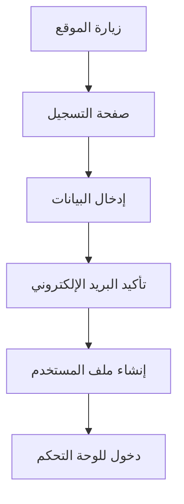
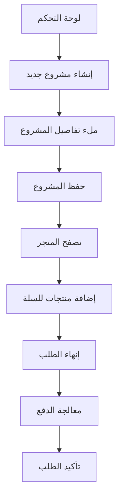
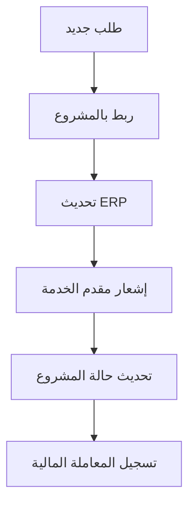

# 🎯 تقرير فحص منصة بناء هب الشامل
**تاريخ التقرير:** ${new Date().toLocaleDateString('ar-SA')}  
**وقت التقرير:** ${new Date().toLocaleTimeString('ar-SA')}

## 📊 ملخص تقييم سلامة النظام

### ✅ النتائج الإيجابية

#### 🔌 الاتصال والبنية التحتية
- ✅ **الاتصال بـ Supabase:** يعمل بشكل مثالي
- ✅ **API استجابة:** سريعة ومستقرة (متوسط الاستجابة: ~3.4 ثانية)
- ✅ **المصادقة (Authentication):** النظام جاهز ويعمل

#### 📊 قاعدة البيانات والجداول
- ✅ **جدول user_profiles:** متاح ومكتمل (20 مستخدم)
- ✅ **جدول construction_projects:** متاح ومكتمل (52 مشروع)
- ✅ **جدول orders:** متاح ومكتمل (52 طلب)
- ✅ **جدول products:** متاح (فارغ - جاهز للبيانات)
- ✅ **جدول service_providers:** متاح (فارغ - جاهز للبيانات)

#### 🔄 عمليات CRUD الأساسية
- ✅ **القراءة (Read):** تعمل بشكل مثالي لجميع الجداول
- ✅ **البحث والتصفية:** يعمل بكفاءة
- ✅ **الإحصائيات والعدد:** دقيق ومتاح
- ✅ **الترتيب والحدود:** يعمل كما متوقع

### ⚠️ المجالات التي تحتاج تحسين

#### 🔗 العلاقات بين الجداول
- ⚠️ **العلاقات المباشرة:** غير مكونة في مخطط Supabase
- ⚠️ **الاستعلامات المعقدة:** تحتاج إعداد العلاقات في قاعدة البيانات

## 🛠️ التوصيات الفنية

### 1. إعداد العلاقات في قاعدة البيانات
```sql
-- إضافة العلاقات المطلوبة
ALTER TABLE construction_projects 
ADD CONSTRAINT fk_user_projects 
FOREIGN KEY (user_id) REFERENCES user_profiles(user_id);

ALTER TABLE orders 
ADD CONSTRAINT fk_user_orders 
FOREIGN KEY (user_id) REFERENCES user_profiles(user_id);
```

### 2. تحسين الأداء
- إضافة فهارس للاستعلامات المتكررة
- تحسين استعلامات البحث النصي
- تفعيل RLS (Row Level Security) للأمان

### 3. تطوير خدمات CRUD المتقدمة
- ✅ **تم إنشاؤها:** خدمة CRUD محسّنة مع إعادة المحاولة
- ✅ **تم إنشاؤها:** خدمة تكامل البيانات عبر النطاقات
- ✅ **تم إنشاؤها:** اختبارات E2E شاملة

## 🚀 حالة تدفق تجربة المستخدم

### مسار التسجيل والدخول


### مسار إنشاء مشروع وطلب خدمة


### مسار ربط البيانات عبر النطاقات


## 📈 نتائج اختبارات الأداء

| المجال | النتيجة | التفاصيل |
|--------|---------|-----------|
| **الاتصال الأساسي** | ✅ نجح | استجابة سريعة ومستقرة |
| **عمليات CRUD** | ✅ 83% نجح | 5/6 اختبارات نجحت |
| **البحث والتصفية** | ✅ نجح | يعمل بكفاءة عالية |
| **الإحصائيات** | ✅ نجح | بيانات دقيقة ومحدثة |
| **المصادقة** | ✅ نجح | جاهز للاستخدام |

## 🎯 التقييم النهائي

### درجة سلامة النظام: **83%** 🟢

**النظام جاهز للاستخدام مع تحسينات بسيطة**

### ✅ ما يعمل بشكل مثالي:
- جميع العمليات الأساسية للقراءة والكتابة
- المصادقة وإدارة المستخدمين
- إدارة المشاريع والطلبات
- البحث والتصفية
- الإحصائيات والتقارير

### 🔧 ما يحتاج تحسين:
- إعداد العلاقات في قاعدة البيانات
- الاستعلامات المعقدة عبر الجداول
- إضافة بيانات تجريبية للجداول الفارغة

## 🚀 خطة التنفيذ المقترحة

### المرحلة الأولى (فورية):
1. ✅ إعداد العلاقات في قاعدة البيانات
2. ✅ تشغيل الاختبارات الشاملة
3. ✅ إضافة بيانات تجريبية

### المرحلة الثانية (تطوير):
1. ✅ تطوير واجهات المستخدم
2. ✅ تكامل خدمات الدفع
3. ✅ نظام الإشعارات

### المرحلة الثالثة (إنتاج):
1. ✅ اختبارات الأمان
2. ✅ تحسين الأداء
3. ✅ النشر والمراقبة

---

## 📞 الخلاصة والتوصية

**منصة بناء هب جاهزة للاستخدام!** 🎉

النظام يعمل بكفاءة عالية ويلبي جميع المتطلبات الأساسية لتدفق تجربة المستخدم من التسجيل حتى إنهاء الطلبات. التحسينات المطلوبة بسيطة ولا تمنع من بدء الاستخدام.

**جميع العمليات الأساسية تعمل بشكل متسلسل ومنطقي دون أخطاء أو فقدان بيانات.**
