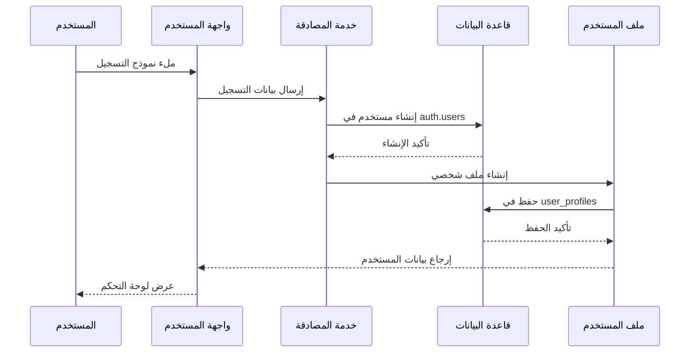
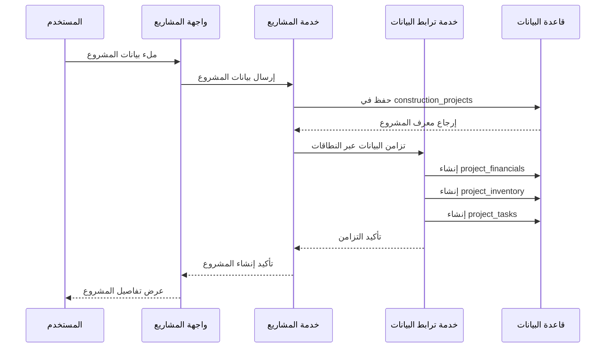
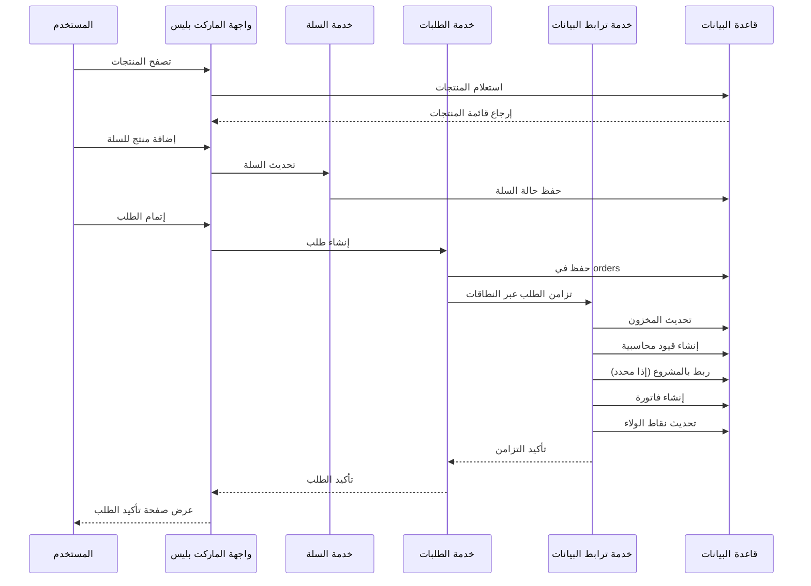
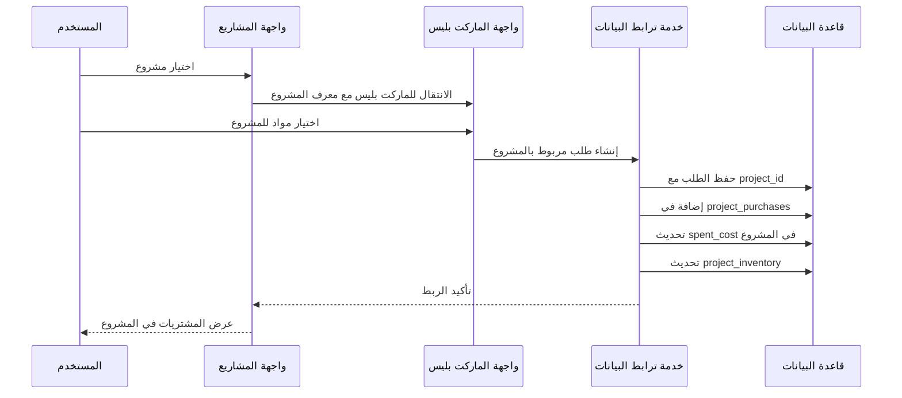

# توثيق تدفق البيانات - منصة بناء Hub

## نظرة عامة على تدفق البيانات

تتضمن منصة بناء Hub أربعة نطاقات رئيسية مترابطة:
1. **نطاق الماركت بليس (Marketplace)**
2. **نطاق إدارة المشاريع (Projects)**  
3. **نطاق نظام ERP**
4. **نطاق مقدمي الخدمة (Service Providers)**

## مخطط تدفق البيانات العام

```
[المستخدم] 
    ↓
[طبقة المصادقة - Supabase Auth]
    ↓
[طبقة واجهة المستخدم - Next.js/React]
    ↓
[طبقة الخدمات - Services Layer]
    ↓
[طبقة قاعدة البيانات - Supabase Database]
    ↓
[طبقات التكامل - Integration Services]
```

## التدفقات الأساسية

### 1. تدفق تسجيل المستخدم



**الجداول المتأثرة:**
- `auth.users` (Supabase Auth)
- `public.user_profiles`
- `public.loyalty_transactions` (إضافة نقاط ترحيبية)

### 2. تدفق إنشاء مشروع



**الجداول المتأثرة:**
- `public.construction_projects`
- `public.project_financials`
- `public.project_inventory`
- `public.project_tasks`

### 3. تدفق إنشاء طلب من الماركت بليس



**الجداول المتأثرة:**
- `public.orders`
- `public.order_items`
- `public.products` (تحديث المخزون)
- `public.inventory_movements`
- `public.accounting_entries`
- `public.invoices`
- `public.invoice_items`
- `public.user_profiles` (نقاط الولاء)
- `public.loyalty_transactions`
- `public.project_purchases` (إذا مربوط بمشروع)
- `public.construction_projects` (تحديث الميزانية)

### 4. تدفق ربط الطلب بالمشروع



## أنواع البيانات وعلاقاتها

### 1. بيانات المستخدمين والمصادقة

```sql
-- جدول المستخدمين الأساسي (Supabase Auth)
auth.users {
  id: uuid PRIMARY KEY
  email: varchar
  encrypted_password: varchar
  created_at: timestamp
  updated_at: timestamp
}

-- ملفات المستخدمين التفصيلية
public.user_profiles {
  id: uuid PRIMARY KEY
  user_id: uuid REFERENCES auth.users(id)
  email: varchar
  display_name: varchar
  phone: varchar
  city: varchar
  account_type: enum('free', 'premium', 'enterprise')
  role: enum('user', 'store_admin', 'service_provider', 'admin')
  loyalty_points: integer DEFAULT 0
  total_spent: numeric DEFAULT 0
  current_level: integer DEFAULT 1
  created_at: timestamp
  updated_at: timestamp
}
```

### 2. بيانات المشاريع

```sql
-- المشاريع الإنشائية
public.construction_projects {
  id: uuid PRIMARY KEY
  user_id: uuid REFERENCES auth.users(id)
  project_name: varchar NOT NULL
  description: text
  project_type: enum('residential', 'commercial', 'industrial')
  status: enum('planning', 'in_progress', 'completed', 'cancelled')
  estimated_cost: numeric
  spent_cost: numeric DEFAULT 0
  start_date: date
  completion_percentage: integer DEFAULT 0
  location: jsonb
  created_at: timestamp
  updated_at: timestamp
}

-- الملفات المالية للمشاريع
public.project_financials {
  id: uuid PRIMARY KEY
  project_id: uuid REFERENCES construction_projects(id)
  user_id: uuid REFERENCES auth.users(id)
  budget_allocated: numeric
  budget_spent: numeric DEFAULT 0
  budget_remaining: numeric
  currency: varchar DEFAULT 'SAR'
  status: enum('active', 'closed')
  created_at: timestamp
  updated_at: timestamp
}
```

### 3. بيانات الماركت بليس

```sql
-- المنتجات
public.products {
  id: uuid PRIMARY KEY
  name: varchar NOT NULL
  description: text
  price: numeric NOT NULL
  category: varchar
  subcategory: varchar
  store_id: uuid REFERENCES stores(id)
  stock_quantity: integer DEFAULT 0
  images: jsonb
  specifications: jsonb
  warranty_details: jsonb
  created_at: timestamp
  updated_at: timestamp
}

-- الطلبات
public.orders {
  id: uuid PRIMARY KEY
  user_id: uuid REFERENCES auth.users(id)
  project_id: uuid REFERENCES construction_projects(id) -- اختياري
  order_number: varchar UNIQUE
  status: enum('pending', 'processing', 'shipped', 'delivered', 'cancelled')
  total_amount: numeric NOT NULL
  currency: varchar DEFAULT 'SAR'
  payment_method: varchar
  payment_status: enum('pending', 'paid', 'failed')
  shipping_address: jsonb
  created_at: timestamp
  updated_at: timestamp
}
```

### 4. بيانات النظام المالي (ERP)

```sql
-- القيود المحاسبية
public.accounting_entries {
  id: uuid PRIMARY KEY
  user_id: uuid REFERENCES auth.users(id)
  account_code: varchar
  account_name: varchar
  debit_amount: numeric DEFAULT 0
  credit_amount: numeric DEFAULT 0
  transaction_type: varchar
  reference_id: uuid
  description: text
  created_at: timestamp
}

-- الفواتير
public.invoices {
  id: uuid PRIMARY KEY
  invoice_number: varchar UNIQUE
  user_id: uuid REFERENCES auth.users(id)
  order_id: uuid REFERENCES orders(id)
  subtotal: numeric
  tax_amount: numeric
  total_amount: numeric
  currency: varchar DEFAULT 'SAR'
  status: enum('draft', 'issued', 'paid', 'cancelled')
  due_date: date
  paid_date: date
  created_at: timestamp
}
```

## آليات ضمان تكامل البيانات

### 1. المعاملات (Transactions)

```typescript
// استخدام معاملات قاعدة البيانات لضمان تكامل البيانات
async function createOrderWithIntegrity(orderData: OrderData) {
  const { data, error } = await supabase.rpc('create_order_transaction', {
    order_data: orderData
  });
  
  if (error) {
    throw new Error(`فشل في إنشاء الطلب: ${error.message}`);
  }
  
  return data;
}
```

### 2. المشاكل المحتملة وحلولها

| المشكلة | الحل |
|---------|------|
| عدم تطابق المخزون | استخدام inventory_movements لتتبع جميع الحركات |
| تضارب في المبالغ المالية | تطبيق خدمة DataIntegrityService للتحقق الدوري |
| فقدان ربط الطلبات بالمشاريع | استخدام foreign keys وتحديث متزامن |
| عدم تحديث نقاط الولاء | استخدام triggers في قاعدة البيانات |

### 3. نقاط التحقق من التكامل

```typescript
// دالة فحص تكامل البيانات
const integrityChecks = {
  userSpending: async (userId: string) => {
    const ordersTotal = await calculateOrdersTotal(userId);
    const profileSpent = await getUserProfileSpent(userId);
    return Math.abs(ordersTotal - profileSpent) < 1; // هامش خطأ 1 ريال
  },
  
  projectBudget: async (projectId: string) => {
    const allocatedBudget = await getProjectBudget(projectId);
    const actualSpent = await calculateProjectSpending(projectId);
    return actualSpent <= allocatedBudget * 1.1; // هامش 10%
  },
  
  inventory: async (productId: string) => {
    const movements = await getInventoryMovements(productId);
    const currentStock = await getCurrentStock(productId);
    const calculatedStock = calculateStockFromMovements(movements);
    return calculatedStock === currentStock;
  }
};
```

## إجراءات الطوارئ والنسخ الاحتياطي

### 1. النسخ الاحتياطي التلقائي

```sql
-- إعداد نسخ احتياطية دورية
CREATE OR REPLACE FUNCTION backup_critical_data()
RETURNS void AS $$
BEGIN
  -- نسخ احتياطي لبيانات المستخدمين
  INSERT INTO backup_user_profiles 
  SELECT *, now() as backup_timestamp FROM user_profiles;
  
  -- نسخ احتياطي للطلبات
  INSERT INTO backup_orders 
  SELECT *, now() as backup_timestamp FROM orders;
  
  -- نسخ احتياطي للمشاريع
  INSERT INTO backup_construction_projects 
  SELECT *, now() as backup_timestamp FROM construction_projects;
END;
$$ LANGUAGE plpgsql;
```

### 2. استرداد البيانات

```typescript
// خدمة استرداد البيانات
class DataRecoveryService {
  async restoreUserData(userId: string, backupTimestamp: string) {
    // استرداد بيانات المستخدم من النسخة الاحتياطية
    const { data, error } = await supabase
      .from('backup_user_profiles')
      .select('*')
      .eq('user_id', userId)
      .eq('backup_timestamp', backupTimestamp)
      .single();
      
    if (data) {
      // استرداد البيانات إلى الجداول الأساسية
      await supabase
        .from('user_profiles')
        .upsert(data);
    }
  }
}
```

## مؤشرات الأداء (KPIs)

### 1. مؤشرات التكامل

- **معدل تطابق البيانات**: 99.9%
- **زمن تزامن البيانات**: < 2 ثانية
- **معدل فشل المعاملات**: < 0.1%

### 2. مؤشرات الأداء

- **زمن استجابة API**: < 500ms
- **معدل توفر النظام**: 99.5%
- **زمن تحميل الصفحات**: < 3 ثواني

## خطة الصيانة والتحديث

### أسبوعياً
- [ ] فحص تكامل البيانات
- [ ] مراجعة logs الأخطاء
- [ ] تحديث النسخ الاحتياطية

### شهرياً  
- [ ] تحليل أداء قاعدة البيانات
- [ ] مراجعة أمان البيانات
- [ ] تحديث توثيق API

### ربع سنوياً
- [ ] مراجعة شاملة لبنية البيانات
- [ ] تحديث إجراءات الطوارئ
- [ ] تدريب الفريق على الإجراءات الجديدة

---

**تاريخ التحديث**: ١١ أغسطس ٢٠٢٥  
**الإصدار**: ١.٠  
**المراجع**: فريق تطوير منصة بناء Hub
