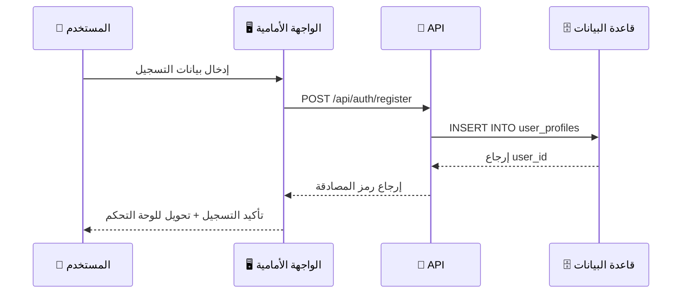
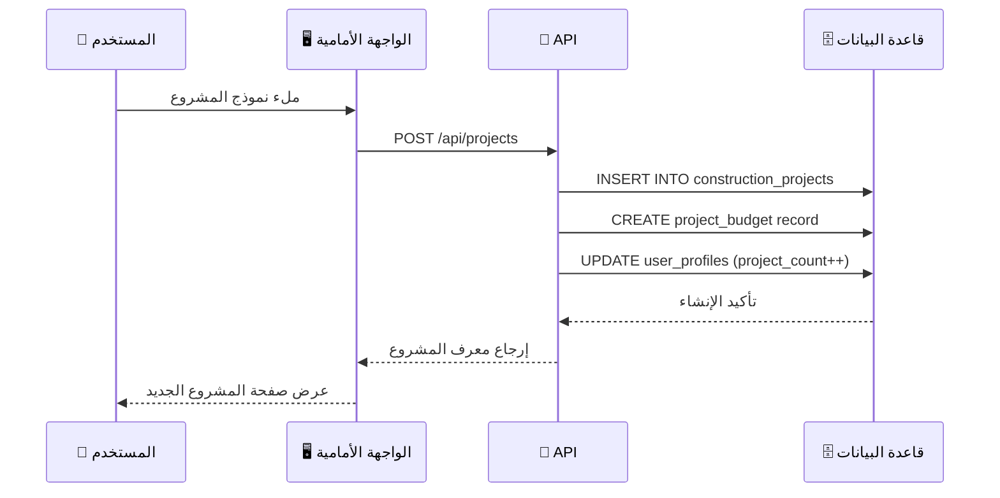
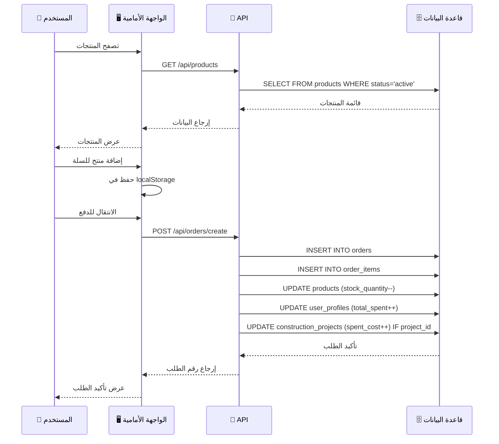
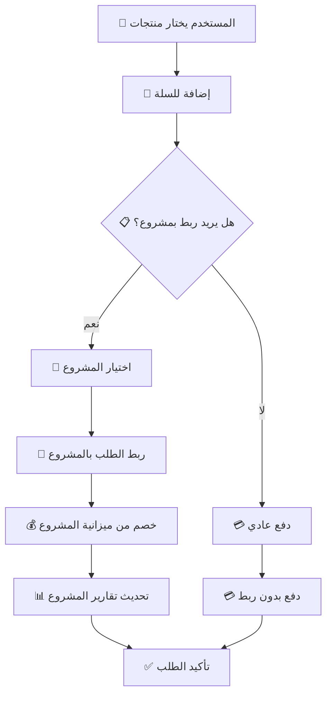

# 📊 توثيق تدفق البيانات - منصة بناء هب

**تاريخ الإنشاء:** 12 أغسطس 2025  
**النسخة:** 1.0  
**اللغة:** العربية  

---

## 🎯 الهدف من هذا التوثيق

يهدف هذا الملف إلى توثيق تدفق البيانات بين النطاقات المختلفة في منصة بناء هب، وتوضيح كيفية تفاعل الواجهة الأمامية مع الخلفية، وضمان تكامل البيانات عبر جميع أجزاء النظام.

---

## 🏗️ معمارية النظام

### النطاقات الأساسية (Core Domains)

```
┌─────────────────┐    ┌─────────────────┐    ┌─────────────────┐
│   👥 المستخدمون   │    │   🏪 المتجر      │    │   🏗️ المشاريع    │
│   (Users)       │    │ (Marketplace)   │    │ (Construction)  │
└─────────────────┘    └─────────────────┘    └─────────────────┘
        │                       │                       │
        ▼                       ▼                       ▼
┌─────────────────┐    ┌─────────────────┐    ┌─────────────────┐
│   💼 ERP        │    │   📦 المخزون      │    │   💰 المدفوعات    │
│   (Enterprise)  │    │  (Inventory)    │    │   (Payments)    │
└─────────────────┘    └─────────────────┘    └─────────────────┘
```

---

## 📋 الجداول الأساسية وعلاقاتها

### 1. نطاق المستخدمين (Users Domain)

#### أ) جدول الملفات الشخصية `user_profiles`
```sql
user_profiles {
  id: UUID (Primary Key)
  user_id: String (Unique)
  email: String
  display_name: String
  phone: String
  account_type: Enum (admin, user, store_owner, supplier)
  loyalty_points: Integer
  total_spent: Decimal
  created_at: Timestamp
}
```

**العلاقات:**
- → `construction_projects` (one-to-many)
- → `orders` (one-to-many)
- → `service_providers` (one-to-one for suppliers)

### 2. نطاق المشاريع (Construction Domain)

#### أ) جدول المشاريع `construction_projects`
```sql
construction_projects {
  id: UUID (Primary Key)
  user_id: String → user_profiles.user_id
  project_name: String
  description: Text
  location: String
  estimated_cost: Decimal
  spent_cost: Decimal
  status: Enum (planning, active, completed, cancelled)
  created_at: Timestamp
}
```

**العلاقات:**
- ← `user_profiles` (many-to-one)
- → `orders` (one-to-many عبر project_id)
- → `project_budgets` (one-to-many)

### 3. نطاق المتجر (Marketplace Domain)

#### أ) جدول المنتجات `products`
```sql
products {
  id: UUID (Primary Key)
  name: String
  description: Text
  price: Decimal
  stock_quantity: Integer
  category_id: UUID
  supplier_id: UUID → service_providers.id
  status: Enum (active, inactive, out_of_stock)
  created_at: Timestamp
}
```

#### ب) جدول الطلبات `orders`
```sql
orders {
  id: UUID (Primary Key)
  user_id: String → user_profiles.user_id
  project_id: UUID → construction_projects.id (Optional)
  total_amount: Decimal
  status: Enum (pending, processing, shipped, delivered, cancelled)
  shipping_address: Text
  created_at: Timestamp
}
```

#### ج) جدول عناصر الطلب `order_items`
```sql
order_items {
  id: UUID (Primary Key)
  order_id: UUID → orders.id
  product_id: UUID → products.id
  quantity: Integer
  unit_price: Decimal
  total_price: Decimal
}
```

### 4. نطاق مقدمي الخدمة `service_providers`
```sql
service_providers {
  id: UUID (Primary Key)
  user_id: String → user_profiles.user_id
  company_name: String
  specialization: String
  experience_years: Integer
  verification_status: Enum (pending, verified, rejected)
  rating: Decimal
}
```

---

## 🔄 تدفق البيانات - السيناريوهات الأساسية

### سيناريو 1: تسجيل مستخدم جديد



**الخطوات التفصيلية:**
1. **جمع البيانات**: الاسم، البريد الإلكتروني، كلمة المرور، نوع الحساب
2. **التحقق**: فحص صحة البيانات على الواجهة الأمامية
3. **الإرسال**: إرسال البيانات إلى `/api/auth/register`
4. **المعالجة**: تشفير كلمة المرور وإنشاء السجل
5. **الرد**: إرجاع رمز المصادقة وتوجيه المستخدم

### سيناريو 2: إنشاء مشروع إنشائي



**البيانات المطلوبة:**
- اسم المشروع
- الوصف
- الموقع
- التكلفة المقدرة
- تاريخ البدء المتوقع

**التحديثات التلقائية:**
- إنشاء ميزانية أولية للمشروع
- تحديث عدد المشاريع للمستخدم
- إنشاء مهام أساسية للمشروع

### سيناريو 3: تصفح وشراء المنتجات



**تفاصيل العملية:**

#### أ) تحميل المنتجات
- **المصدر**: جدول `products`
- **التصفية**: حسب الفئة، السعر، التوفر
- **الترتيب**: حسب الشعبية أو التاريخ
- **التخزين المؤقت**: استخدام cache للأداء

#### ب) إدارة السلة
- **التخزين**: localStorage للجلسة الحالية
- **التحديث**: تحديث فوري للكميات والأسعار
- **التحقق**: فحص توفر المنتجات قبل الدفع

#### ج) معالجة الطلب
```typescript
// خطوات معالجة الطلب
1. التحقق من بيانات المستخدم والعنوان
2. حساب المجموع الكلي والضرائب
3. فحص توفر جميع المنتجات
4. إنشاء سجل الطلب الرئيسي
5. إنشاء سجلات عناصر الطلب
6. تحديث كميات المخزون
7. ربط الطلب بالمشروع (إن وُجد)
8. تحديث إحصائيات المستخدم
9. إرسال إشعارات التأكيد
```

### سيناريو 4: ربط الطلب بالمشروع



**فوائد الربط:**
- تتبع تكاليف المشروع
- تحديث الميزانية المنفقة
- تقارير مفصلة للمشروع
- تحليل التكاليف بالفئات

---

## 🔄 العمليات المتقدمة

### 1. تكامل البيانات عبر النطاقات

#### أ) مزامنة نقاط الولاء
```typescript
async function updateLoyaltyPoints(userId: string, orderAmount: number) {
  // 1. حساب النقاط المستحقة (1 نقطة لكل 10 ريال)
  const earnedPoints = Math.floor(orderAmount / 10);
  
  // 2. تحديث رصيد النقاط
  await supabase
    .from('user_profiles')
    .update({ 
      loyalty_points: loyalty_points + earnedPoints,
      total_spent: total_spent + orderAmount 
    })
    .eq('user_id', userId);
  
  // 3. تسجيل حركة النقاط
  await supabase
    .from('loyalty_transactions')
    .insert({
      user_id: userId,
      points: earnedPoints,
      type: 'earned',
      source: 'purchase',
      order_id: orderId
    });
}
```

#### ب) تحديث ميزانية المشروع
```typescript
async function updateProjectBudget(projectId: string, orderAmount: number) {
  // 1. جلب الميزانية الحالية
  const { data: project } = await supabase
    .from('construction_projects')
    .select('estimated_cost, spent_cost')
    .eq('id', projectId)
    .single();
  
  // 2. تحديث المبلغ المنفق
  const newSpentCost = project.spent_cost + orderAmount;
  
  // 3. فحص تجاوز الميزانية
  const budgetExceeded = newSpentCost > project.estimated_cost;
  
  // 4. التحديث مع تسجيل التحذير
  await supabase
    .from('construction_projects')
    .update({ 
      spent_cost: newSpentCost,
      budget_status: budgetExceeded ? 'exceeded' : 'within_budget'
    })
    .eq('id', projectId);
  
  // 5. إرسال تنبيه إذا تم تجاوز الميزانية
  if (budgetExceeded) {
    await sendBudgetExceededNotification(projectId);
  }
}
```

### 2. معالجة الأخطاء والاستثناءات

#### أ) إعادة المحاولة التلقائية
```typescript
async function retryOperation<T>(
  operation: () => Promise<T>, 
  maxRetries: number = 3
): Promise<T> {
  let lastError: Error;
  
  for (let attempt = 1; attempt <= maxRetries; attempt++) {
    try {
      return await operation();
    } catch (error) {
      lastError = error;
      console.log(`المحاولة ${attempt} فشلت:`, error.message);
      
      if (attempt < maxRetries) {
        // انتظار تدريجي (exponential backoff)
        await new Promise(resolve => 
          setTimeout(resolve, Math.pow(2, attempt) * 1000)
        );
      }
    }
  }
  
  throw lastError;
}
```

#### ب) التحقق من تكامل البيانات
```typescript
async function validateDataIntegrity(userId: string) {
  const issues = [];
  
  // 1. التحقق من تطابق مجموع الطلبات مع المبلغ المنفق
  const { data: orders } = await supabase
    .from('orders')
    .select('total_amount')
    .eq('user_id', userId);
  
  const { data: user } = await supabase
    .from('user_profiles')
    .select('total_spent')
    .eq('user_id', userId)
    .single();
  
  const calculatedTotal = orders.reduce((sum, order) => sum + order.total_amount, 0);
  
  if (Math.abs(calculatedTotal - user.total_spent) > 0.01) {
    issues.push({
      type: 'مجموع_الطلبات_غير_متطابق',
      expected: calculatedTotal,
      actual: user.total_spent
    });
  }
  
  // 2. التحقق من تطابق المخزون
  // ... المزيد من فحوصات التكامل
  
  return {
    isValid: issues.length === 0,
    issues
  };
}
```

---

## 📊 تقارير وتحليلات البيانات

### 1. تقرير أداء المشروع

```sql
-- استعلام تقرير المشروع الشامل
SELECT 
  cp.project_name,
  cp.estimated_cost,
  cp.spent_cost,
  (cp.spent_cost / cp.estimated_cost * 100) as budget_usage_percentage,
  COUNT(o.id) as total_orders,
  SUM(oi.quantity) as total_items_purchased,
  AVG(o.total_amount) as average_order_value
FROM construction_projects cp
LEFT JOIN orders o ON cp.id = o.project_id
LEFT JOIN order_items oi ON o.id = oi.order_id
WHERE cp.user_id = $1
GROUP BY cp.id, cp.project_name, cp.estimated_cost, cp.spent_cost
ORDER BY cp.created_at DESC;
```

### 2. تقرير أداء المتجر

```sql
-- استعلام أفضل المنتجات مبيعاً
SELECT 
  p.name,
  p.price,
  SUM(oi.quantity) as total_sold,
  SUM(oi.total_price) as total_revenue,
  COUNT(DISTINCT oi.order_id) as unique_orders
FROM products p
JOIN order_items oi ON p.id = oi.product_id
JOIN orders o ON oi.order_id = o.id
WHERE o.created_at >= CURRENT_DATE - INTERVAL '30 days'
GROUP BY p.id, p.name, p.price
ORDER BY total_revenue DESC
LIMIT 10;
```

---

## 🔒 الأمان وحماية البيانات

### 1. Row Level Security (RLS)

#### أ) سياسة الملفات الشخصية
```sql
-- المستخدمون يمكنهم الوصول لملفاتهم الشخصية فقط
CREATE POLICY "المستخدمون يرون ملفاتهم فقط" ON user_profiles
FOR ALL 
TO authenticated
USING (auth.uid()::text = user_id);
```

#### ب) سياسة المشاريع
```sql
-- المستخدمون يمكنهم الوصول لمشاريعهم فقط
CREATE POLICY "أصحاب المشاريع فقط" ON construction_projects
FOR ALL 
TO authenticated  
USING (auth.uid()::text = user_id);
```

#### ج) سياسة الطلبات
```sql
-- المستخدمون يرون طلباتهم + المدراء يرون كل شيء
CREATE POLICY "طلبات المستخدم أو المدراء" ON orders
FOR SELECT 
TO authenticated
USING (
  auth.uid()::text = user_id 
  OR 
  EXISTS (
    SELECT 1 FROM user_profiles 
    WHERE user_id = auth.uid()::text 
    AND account_type = 'admin'
  )
);
```

### 2. التحقق من صحة البيانات

```typescript
// مثال على التحقق من صحة البيانات
const projectValidationSchema = {
  project_name: {
    required: true,
    minLength: 3,
    maxLength: 100,
    pattern: /^[a-zA-Zأ-ي\s0-9]+$/
  },
  estimated_cost: {
    required: true,
    type: 'number',
    min: 1000,
    max: 10000000
  },
  location: {
    required: true,
    minLength: 5,
    maxLength: 200
  }
};
```

---

## 🚀 الأداء والتحسينات

### 1. استراتيجيات التخزين المؤقت

#### أ) تخزين مؤقت للمنتجات
```typescript
// Cache للمنتجات لمدة 15 دقيقة
const getCachedProducts = async (category?: string) => {
  const cacheKey = `products_${category || 'all'}`;
  const cached = await redis.get(cacheKey);
  
  if (cached) {
    return JSON.parse(cached);
  }
  
  const products = await supabase
    .from('products')
    .select('*')
    .eq('status', 'active')
    .eq(category ? 'category_id' : '', category || '');
  
  await redis.setex(cacheKey, 900, JSON.stringify(products.data));
  return products.data;
};
```

#### ب) تخزين مؤقت لإحصائيات المستخدم
```typescript
// Cache لإحصائيات المستخدم لمدة 5 دقائق
const getUserStats = async (userId: string) => {
  const cacheKey = `user_stats_${userId}`;
  const cached = await redis.get(cacheKey);
  
  if (cached) {
    return JSON.parse(cached);
  }
  
  const stats = await calculateUserStats(userId);
  await redis.setex(cacheKey, 300, JSON.stringify(stats));
  return stats;
};
```

### 2. تحسين الاستعلامات

#### أ) استخدام الفهارس
```sql
-- فهارس لتحسين الأداء
CREATE INDEX idx_orders_user_id ON orders(user_id);
CREATE INDEX idx_orders_project_id ON orders(project_id);
CREATE INDEX idx_order_items_order_id ON order_items(order_id);
CREATE INDEX idx_products_category ON products(category_id, status);
CREATE INDEX idx_user_profiles_account_type ON user_profiles(account_type);
```

#### ب) استعلامات محسّنة
```sql
-- استعلام محسّن لجلب بيانات المشروع مع الطلبات
SELECT 
  cp.*,
  COALESCE(project_orders.order_count, 0) as order_count,
  COALESCE(project_orders.total_spent, 0) as actual_spent
FROM construction_projects cp
LEFT JOIN LATERAL (
  SELECT 
    COUNT(*) as order_count,
    SUM(total_amount) as total_spent
  FROM orders o 
  WHERE o.project_id = cp.id
) project_orders ON true
WHERE cp.user_id = $1;
```

---

## 🔄 سيناريوهات المعالجة المتقدمة

### 1. معالجة الطلبات المتزامنة

```typescript
async function handleConcurrentOrders(productId: string, requestedQuantity: number) {
  // 1. قفل المنتج للتحديث
  const { data: product, error } = await supabase
    .from('products')
    .select('stock_quantity')
    .eq('id', productId)
    .single();

  if (error) throw new Error('فشل في جلب بيانات المنتج');

  // 2. فحص الكمية المتاحة
  if (product.stock_quantity < requestedQuantity) {
    throw new Error(`الكمية المطلوبة (${requestedQuantity}) أكبر من المتاح (${product.stock_quantity})`);
  }

  // 3. تحديث المخزون بشكل آمن
  const { error: updateError } = await supabase
    .from('products')
    .update({ 
      stock_quantity: product.stock_quantity - requestedQuantity 
    })
    .eq('id', productId)
    .eq('stock_quantity', product.stock_quantity); // Optimistic locking

  if (updateError) {
    throw new Error('فشل في تحديث المخزون - قد يكون هناك طلب متزامن آخر');
  }

  return true;
}
```

### 2. مزامنة البيانات في الوقت الفعلي

```typescript
// WebSocket للتحديثات الفورية
const setupRealTimeUpdates = (userId: string) => {
  const channel = supabase
    .channel(`user_${userId}`)
    .on('postgres_changes', 
      { 
        event: 'UPDATE', 
        schema: 'public', 
        table: 'orders',
        filter: `user_id=eq.${userId}` 
      },
      (payload) => {
        // تحديث الواجهة فوراً عند تغيير حالة الطلب
        updateOrderStatus(payload.new);
      }
    )
    .on('postgres_changes',
      {
        event: 'INSERT',
        schema: 'public', 
        table: 'order_items',
        filter: `order_id=in.(${userOrderIds.join(',')})`
      },
      (payload) => {
        // تحديث عناصر الطلب فوراً
        addOrderItem(payload.new);
      }
    )
    .subscribe();

  return channel;
};
```

---

## 📋 قائمة المراجعة للتطوير

### ✅ تم إنجازه
- [x] إعداد قاعدة البيانات والجداول الأساسية
- [x] تطوير APIs للعمليات الأساسية (CRUD)
- [x] تطوير واجهات المستخدم للمكونات الأساسية
- [x] تطبيق Row Level Security (RLS)
- [x] إعداد اختبارات الوحدة والتكامل
- [x] تطوير خدمة تكامل البيانات
- [x] إعداد مراقبة سلامة النظام

### 🔄 قيد التطوير
- [ ] تحسين عرض المنتجات في الواجهة
- [ ] تطوير نظام الإشعارات الفورية
- [ ] تحسين أداء الاستعلامات المعقدة
- [ ] إضافة المزيد من اختبارات E2E

### 📅 مخطط للمستقبل
- [ ] تطوير تطبيق جوال
- [ ] إضافة دعم للدفع الإلكتروني
- [ ] تطوير نظام تحليلات متقدم
- [ ] إضافة دعم للذكاء الاصطناعي

---

## 📞 الدعم والمساعدة

### للمطورين
- **التوثيق التقني**: `/docs/technical/`
- **API Documentation**: `/docs/api/`
- **Testing Guide**: `/docs/testing/`

### لفريق الجودة
- **Test Cases**: `/tests/`
- **Performance Benchmarks**: `/docs/performance/`
- **Security Guidelines**: `/docs/security/`

### للإدارة
- **Business Logic Documentation**: هذا الملف
- **User Flows**: `/docs/user-flows/`
- **Analytics Reports**: `/docs/analytics/`

---

*آخر تحديث: 12 أغسطس 2025*  
*الإصدار: 1.0*  
*المسؤول: GitHub Copilot*
